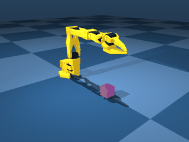

# so101-sim2real

[](https://pypi.org/project/lerobot-env-so101/)
[](LICENSE)

A MuJoCo simulation environment for the SO-101 arm (SO-ARM101), shipped as a
[lerobot](https://github.com/huggingface/lerobot) third-party plugin.

SO-101（通称 SO-ARM101）の MuJoCo シミュレーション環境。
[lerobot](https://github.com/huggingface/lerobot) のサードパーティプラグインとして公開している。



## The package / パッケージ

The installable artifact of this repo is
[`packages/lerobot_env_so101`](packages/lerobot_env_so101) — a standalone
SO-101 pick-cube environment, auto-discovered by lerobot v0.6.0+ via the
`lerobot_env_*` plugin convention
([lerobot#3823](https://github.com/huggingface/lerobot/pull/3823)) and usable
standalone as a plain `gymnasium` environment.

このリポジトリの成果物は [`packages/lerobot_env_so101`](packages/lerobot_env_so101)。
lerobot v0.6.0+ が `lerobot_env_*` 命名規約で自動発見するプラグインで、
素の `gymnasium` 環境としても単体で使える。

```bash
pip install lerobot-env-so101
```

```python
import gymnasium as gym
import lerobot_env_so101  # registers the env

env = gym.make("lerobot_env_so101/SO101PickCube-v0")
```

See the [package README](packages/lerobot_env_so101/README.md) for the action
space design (native 4-dim `[dx, dy, dz, grasp]` — and why) and asset
provenance.

action space の設計（ネイティブ4次元 `[dx, dy, dz, grasp]` にした理由）と
アセットの出自は[パッケージ README](packages/lerobot_env_so101/README.md) を参照。

## Why a standalone plugin, not an upstream PR / なぜ上流 PR ではなくプラグインか

gym-hil and the other single-environment repos (`gym-pusht` / `gym-aloha` /
`gym-xarm`) have been in maintenance-only mode for over a year, while lerobot
now provides gatekeeper-free publishing paths (EnvHub and `lerobot_env_*`
plugin auto-discovery). This repo uses the latter.

gym-hil ほか「1環境1リポジトリ」型の repo は1年以上メンテナンスのみの状態で、
一方 lerobot にはゲートキーパー不要の公開経路（EnvHub / `lerobot_env_*`
プラグイン自動発見）が整備された。本リポジトリは後者を使う。

## macOS notes / macOS での注意

- Runs natively on Apple Silicon: `pip install mujoco` (verified with 3.10.0)
- **`mjpython` is only required for `launch_passive()`.** Run the blocking
  `launch()` with plain `python` — the reverse crashes with
  `RuntimeError: Caught an unknown exception!`
  ([mujoco#742](https://github.com/google-deepmind/mujoco/issues/742))
- `mjpython` and offscreen rendering cannot be combined; record videos from a
  separate script
- Don't expect MJX (GPU-parallel) on Mac — the JAX Metal backend has been
  experimental and unmaintained since 2024-10. Isaac Sim / Isaac Lab do not
  run on Mac

- Apple Silicon でネイティブ動作。`pip install mujoco`（3.10.0 で確認）
- **`mjpython` が要るのは `launch_passive()` だけ**。ブロッキングの `launch()` は
  素の `python` で動かす（逆にすると [mujoco#742](https://github.com/google-deepmind/mujoco/issues/742) のエラーで落ちる）
- `mjpython` とオフスクリーンレンダリングは併用不可。動画記録は別スクリプトに分ける
- MJX（GPU 並列）を Mac に期待しない。Isaac Sim / Isaac Lab も Mac では動かない

## Development setup / 開発セットアップ

```bash
python3 -m venv .venv && .venv/bin/pip install mujoco numpy

# Sparse-checkout reference models from mujoco_menagerie (vendor/ is gitignored)
git clone --depth 1 --filter=blob:none --sparse \
  https://github.com/google-deepmind/mujoco_menagerie.git vendor/menagerie
cd vendor/menagerie && git sparse-checkout set robotstudio_so101 trs_so_arm100

# Inspect physics parameters of the current model
.venv/bin/python sim/inspect_model.py
```

## Layout / ディレクトリ

```
packages/lerobot_env_so101/   The pip-installable plugin / pip で入る本体
sim/     Environment tooling and model inspection / 環境実装とモデル検査ツール
sysid/   System identification (Phase 2, not started) / 同定スクリプト（未着手）
data/    Real-robot logs (Phase 2, not started) / 実機ログ（未着手）
docs/    Reference notes and baselines / 参照資料・ベースライン記録
vendor/  Sparse checkouts of external repos (gitignored) / 外部リポジトリ（gitignore 済み）
```

## License / ライセンス

Apache-2.0. Asset provenance and attributions are documented in
[`assets/README.md`](packages/lerobot_env_so101/lerobot_env_so101/assets/README.md).

Apache-2.0。アセットの出自と帰属表示は
[`assets/README.md`](packages/lerobot_env_so101/lerobot_env_so101/assets/README.md) に記載。
