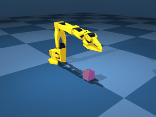

---
hide:
  - navigation
---

<div class="hero" markdown="1">
<p class="hero__eyebrow">SO-101 · MuJoCo · lerobot plugin</p>

# lerobot_env_so101

<p class="hero__lead">A pick-cube environment for the SO-101 arm where
<strong>every action dimension does something</strong>. Four dimensions, no dead
inputs, and a gripper command that means what it says. Runs as a plain
<code>gymnasium</code> environment; lerobot is optional.</p>

<div class="hero__cta" markdown="1">
[Get started](getting-started.md){ .hero-cta .hero-cta--primary }
[API reference](api.md){ .hero-cta }
[PyPI](https://pypi.org/project/lerobot-env-so101/){ .hero-cta }
</div>
</div>

```bash
pip install lerobot-env-so101
```

## The action space, drawn to scale

<div class="axes">
<div class="axes__scale"><span></span><span><i>-1</i><i>0</i><i>+1</i></span><span></span></div>
<div class="axis" style="--lo:0; --hi:100; --zero:50">
  <span class="axis__name">dx</span><span class="axis__track"></span><span class="axis__kind">delta</span>
</div>
<div class="axis" style="--lo:0; --hi:100; --zero:50">
  <span class="axis__name">dy</span><span class="axis__track"></span><span class="axis__kind">delta</span>
</div>
<div class="axis" style="--lo:0; --hi:100; --zero:50">
  <span class="axis__name">dz</span><span class="axis__track"></span><span class="axis__kind">delta</span>
</div>
<div class="axis axis--absolute" style="--lo:50; --hi:100; --zero:50">
  <span class="axis__name">grasp</span><span class="axis__track"></span><span class="axis__kind">absolute</span>
</div>
</div>

<p class="axes__caption" markdown="1">The vertical rule marks zero. For a position delta it
sits at the centre of the range; for <code>grasp</code> the same zero is the
left edge, because it is an absolute target — 0 is fully closed, not
"unchanged". That asymmetry is the whole action space:
<code>Box([-1, -1, -1, 0], 1.0, (4,), float32)</code>.</p>

The upstream `gym-hil` port this came from declared three more dimensions that
the IK solver silently discarded:

<div class="axes">
<div class="axis axis--dead" style="--lo:0; --hi:100; --zero:50">
  <span class="axis__name">drx</span><span class="axis__track"></span><span class="axis__kind">dead</span>
</div>
<div class="axis axis--dead" style="--lo:0; --hi:100; --zero:50">
  <span class="axis__name">dry</span><span class="axis__track"></span><span class="axis__kind">dead</span>
</div>
<div class="axis axis--dead" style="--lo:0; --hi:100; --zero:50">
  <span class="axis__name">drz</span><span class="axis__track"></span><span class="axis__kind">dead</span>
</div>
</div>

<p class="axes__caption" markdown="1">SO-101's 5-DOF arm cannot track a 6-DOF Cartesian pose,
so a policy could spend capacity learning to depend on inputs that had zero
effect on the simulation. Verified rather than assumed: perturbing each of the
four remaining dimensions moves the state — 0 of 4 dead. See
[Action space](action-space.md).</p>

## What it looks like



*A hand-written controller driving a reach→gripper-close motion — not a
successful pick-and-lift. A top-down grasp is not yet reachable with the
position-only IK; see [Limitations](limitations.md#top-down-grasp-is-not-reachable).*

## Two more things the upstream port got wrong

- **The gripper was an increment.** `grasp=0` used to mean "leave it alone";
  it now means "fully closed", mapped onto the actuator's native radian range.
  This is a breaking change as of v0.2.0.
- **Sparse-mode success ignored the gripper.** Upstream computes a strict
  success check, then replaces it with a lift-only test in sparse mode. Measured
  here before the fix: the gripper 0.092 m from the block (threshold 0.05 m),
  block lifted 0.20 m, reported as success. A block knocked upward counted as a
  pick.

Both are detailed in
[What changed vs. the upstream port](lerobot-integration.md#what-changed-vs-the-upstream-port).

## Where to go next

| If you want to | Read |
|---|---|
| Run your first episode | [Getting started](getting-started.md) |
| Use it from lerobot's CLI or a policy | [Using it with lerobot](lerobot-integration.md) |
| Understand what the 4 action dimensions do | [Action space](action-space.md) |
| Debug a crash or a surprising result | [Limitations and troubleshooting](limitations.md) |
| Look up a class or argument | [API reference](api.md) |

## License and attribution

Apache-2.0. The SO-101 MJCF/URDF and the original control code were authored by
**Paul Loh** ([github.com/lohpaul9](https://github.com/lohpaul9)) and ported from
[lohpaul9/gym-hil](https://github.com/lohpaul9/gym-hil); the base `gym-hil`
project structure is Copyright 2024 The HuggingFace Inc. team. Full attribution
is in [Using it with lerobot](lerobot-integration.md#attribution).
